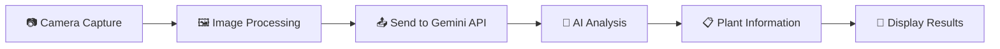

# 🌱 Plant Identifier

<div align="center">

**An AI-powered Android app that identifies plants and provides detailed care instructions**

[](https://android.com)
[](https://developer.android.com)
[](https://ai.google.dev)
[](LICENSE)


*Identify any plant with just a photo and get expert care advice*

</div>

---

## ✨ Features

<table>
<tr>
<td align="center" width="33%">

<h3>📸 Smart Capture</h3>
High-quality photo capture with automatic optimization and memory management
</td>
<td align="center" width="33%">

<h3>🧠 AI Recognition</h3>
Powered by Google Gemini 1.5 Flash for accurate plant identification
</td>
<td align="center" width="33%">

<h3>🌿 Care Guide</h3>
Detailed care instructions including watering, lighting, and soil needs
</td>
</tr>
</table>

## 📱 Screenshots

<div align="center">


</div>

## 🚀 Quick Start

### Prerequisites
- 📱 Android Studio Arctic Fox or later
- 🎯 Android SDK 21+ (supports 99%+ of devices)
- 🔑 Google Gemini API key

### Installation

1. **📥 Clone the repository**
   ```bash
   git clone https://github.com/yourusername/plant-identifier.git
   cd plant-identifier
   ```

2. **🔐 Configure API Key**
   
   Create `gradle.properties` in your project root:
   ```properties
   GEMINI_API_KEY=your_actual_api_key_here
   ```

3. **📁 Add FileProvider Configuration**
   
   Create `res/xml/file_paths.xml`:
   ```xml
   <?xml version="1.0" encoding="utf-8"?>
   <paths xmlns:android="http://schemas.android.com/apk/res/android">
       <external-files-path name="my_images" path="Pictures" />
   </paths>
   ```

4. **🏗️ Build and Run**
   ```bash
   ./gradlew assembleDebug
   ```

### 🔑 Getting a Gemini API Key

1. Visit [Google AI Studio](https://makersuite.google.com/app/apikey)
2. Create a new project and generate an API key
3. Copy the key to your `gradle.properties` file

## 🏗️ Architecture

```
📁 Plant Identifier App
├── 🎯 MainActivity.java          # Main app controller
├── 🌐 API Layer
│   ├── GeminiApiService.java     # Retrofit API interface
│   ├── GeminiRequest.java        # Request models
│   └── GeminiResponse.java       # Response models
├── 📊 Data Models
│   ├── Content.java              # Content structure
│   └── Part.java                 # Request parts
└── 🎨 UI Layer
    ├── activity_main.xml         # Main layout
    └── colors.xml                # App theme colors
```

## 💡 How It Works



1. **📸 Capture**: Take a photo of any plant
2. **⚡ Process**: App optimizes image for AI analysis
3. **🚀 Analyze**: Gemini AI identifies the plant species
4. **📖 Learn**: Get detailed care instructions
5. **💚 Care**: Keep your plants healthy and happy!

## 🛠️ Tech Stack

<div align="center">

| Technology | Purpose | Version |
|------------|---------|---------|
|  | Core Language | 11 |
|  | Platform | SDK 21+ |
|  | UI Framework | 1.11.0 |
|  | HTTP Client | 2.9.0 |
|  | AI Engine | 1.5 Flash |

</div>

## 🎨 Design Highlights

- **🎯 Material Design 3**: Modern, intuitive interface
- **🌈 Green Theme**: Nature-inspired color palette
- **📱 Responsive Layout**: Works on all screen sizes
- **⚡ Smooth Animations**: Delightful user interactions
- **♿ Accessible**: Screen reader and keyboard navigation support

## 🔧 Configuration

### 📂 Required Files

Create these files in your project:

**`res/xml/file_paths.xml`**
```xml
<?xml version="1.0" encoding="utf-8"?>
<paths xmlns:android="http://schemas.android.com/apk/res/android">
    <external-files-path name="my_images" path="Pictures" />
</paths>
```

**`gradle.properties`**
```properties
GEMINI_API_KEY=your_api_key_here
android.useAndroidX=true
android.enableJetifier=true
```

### 🔐 Security Features

- ✅ API keys secured in BuildConfig
- ✅ Temporary image storage only
- ✅ HTTPS-only communication
- ✅ No personal data collection
- ✅ Proper permission handling

## 🧪 Testing

### Manual Testing Checklist

- [x] 📷 Camera permission flow
- [x] 📸 Photo capture functionality  
- [x] 🖼️ Image processing and display
- [x] 🌐 API request/response handling
- [x] ❌ Error handling (network, API failures)
- [x] 💾 Memory management
- [x] 🔄 App lifecycle management

## 🐛 Troubleshooting

<details>
<summary><strong>🔑 API Key Issues</strong></summary>

- Ensure `GEMINI_API_KEY` is in `gradle.properties`
- Rebuild project after adding key
- Check API key validity at Google AI Studio
</details>

<details>
<summary><strong>📷 Camera Problems</strong></summary>

- Verify camera permissions in device settings
- Check FileProvider configuration
- Ensure device has camera hardware
</details>

<details>
<summary><strong>💾 Memory Issues</strong></summary>

- App handles image optimization automatically
- If problems persist, reduce `MAX_IMAGE_DIMENSION`
- Clear app cache and restart
</details>

## 🚀 Roadmap

### 🎯 Next Features
- [ ] 📅 **Plant Care Reminders** - Set watering schedules
- [ ] 📚 **Plant Collection** - Save your identified plants
- [ ] 🔍 **Advanced Search** - Filter by plant characteristics
- [ ] 📤 **Social Sharing** - Share discoveries with friends
- [ ] 🌍 **Offline Mode** - Basic identification without internet

### 🛠️ Technical Improvements
- [ ] ⚡ **Performance** - Enhanced image compression
- [ ] 🌐 **Localization** - Multi-language support
- [ ] ♿ **Accessibility** - Enhanced screen reader support
- [ ] 💾 **Caching** - Store recent identifications

## 🤝 Contributing

We love contributions! Here's how you can help:

1. **🍴 Fork** the repository
2. **🌿 Create** a feature branch (`git checkout -b feature/amazing-feature`)
3. **💻 Commit** your changes (`git commit -m 'Add amazing feature'`)
4. **📤 Push** to the branch (`git push origin feature/amazing-feature`)
5. **🔄 Open** a Pull Request

### 👥 Contributors

<a href="https://github.com/yourusername/plant-identifier/graphs/contributors">
  
</a>

## 📄 License

This project is licensed under the MIT License - see the [LICENSE](LICENSE) file for details.

## 🙏 Acknowledgments

- 🤖 **Google Gemini AI** for powerful plant recognition
- 🎨 **Material Design** for beautiful UI components
- 🌱 **Plant enthusiasts** who inspire this project
- 👨‍💻 **Open source community** for amazing tools and libraries

## 📞 Support

Need help? We've got you covered!

- 💬 [Create an Issue](https://github.com/yourusername/plant-identifier/issues)
- 📖 [Check Documentation](docs/)
- 🌐 [Visit Google AI Studio](https://makersuite.google.com)

---

<div align="center">

**🌱 Built with ❤️ for plant lovers and Android developers**

⭐ **Star this repo if you found it helpful!** ⭐

[📱 Download APK](releases/latest) • [📖 Documentation](docs/) • [🐛 Report Bug](issues/) • [💡 Request Feature](issues/)

</div>
